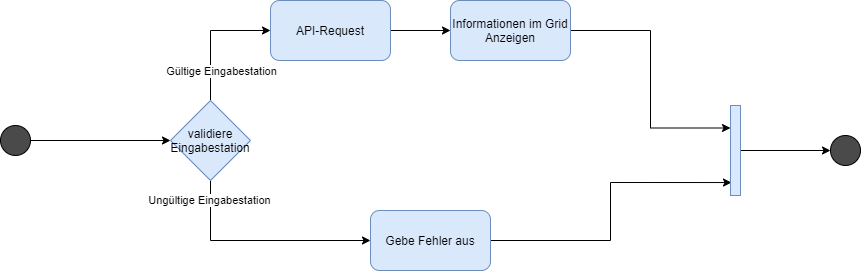

# Dokumentation

## Autor und Datum

Version: 1.0

Autor: Nicola Fioretti

Datum: 01.04.21 

## Inhaltsverzeichnis

* [Autor, Datum](./#autor-und-datum)
* [Inhaltsverzeichnis](./#inhaltsverzeichnis)
* [User Storys](user-story.md)
* [Mockup](mockup.md)
* [Aktivitätsdiagramm](./#aktivitaetsdiagramm)
* [Testfälle](testfaelle.md)
* [Testprotokoll](testprotokoll.md)
* [Guide](guide.md)

## Einleitung

Das ist die Dokumentation für das Projekt im ÜK-318 von Nicola Fioretti. In dieser Dokumentation befindet sich eine kleine Anleitung zur verwendung der Applikation. Funktion der Applikation ist es verbindungen aus dem Schweizer ÖV-Netz abzufragen. Die Applikation wurde mit WPF in C\# geschrieben. Die Zielplattform dieser Applikation ist ein Computer mit Windows als Opertaing System.

## Zweck

In dieser Dokumentation sind die User-Storys, die Mockups und Andere Planungsdokumente vorhanden. In dieser Dokumentation sind auch Testfälle und Known-Issues abgedeckt.

## Umsetzung der Funktionen

### Nicht \(Komplett\) erfüllte AK's

#### [Auto-Complete](user-story.md#auto-completion)


**Anforderung:** die Benutzer-Texteingaben haben eine Autocompletion durch die Möglichen Stationsnahmen.


Umsetzung: Wenn in die Text-Box geschrieben wird tauchen vorschläge auf welche man auswählen kann, beim auswählen eines Vorschlags wird dieser zum inhalt der Text-Box gemacht

#### [Karte](user-story.md#karte)


**Anforderung:** Die Umliegenden Stationen werden auf der Karte mitangezeigt


Umsetzung: Es wird auf der Karte Jeweils immer nur die ausgewählte Station angezeigt.


**Anforderung:** Auf der Karte kann der Aktuelle standort angezeigt werden ohne ausgewählte Station


Umsetzung: Es werden die Station in der Nähe als Button angezeigt, durch Klicken können die Einzelnen Stationen angesehen werden.

#### [Favorit](user-story.md#favorit-station)


**Anforderung:** Favorit-Stationen können bereits vor der eingabe von Text ausgewählt werden


Umsetzung: Die Favorit-Stationen welche den Text aus der Text-Box beinhalten werden vor den anderen Stationen angezeigt.

### Known-Issues

#### Tab-Selection-Bug bei ListBox

Wenn bei einem Station-Textfeld eine Station durch das klicken auf ein Element aus der ListBox ausgewählt wird, bleibt dieses Element ausgewählt auch wenn es ausgeblendet wird. Mit der Tab-Taste wird dann zuerst durch die verbleibenden Elemente der ListBox iteriert.

## [Mockups](mockup.md)

## Aktivitätsdiagramm

Aktivitätsdiagramm zu [User-Story](user-story.md#abfahrtstafel) 

Als erstes wird der im Eingabefeld eingegebene Text validiert, wenn dieser eine Station ist wird ein API-Request gemacht und das Resultat angezeigt. Ansonsten wird ein Fehler angezeigt.

|  |
| :--- |

