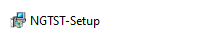
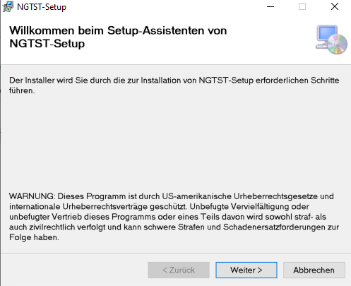
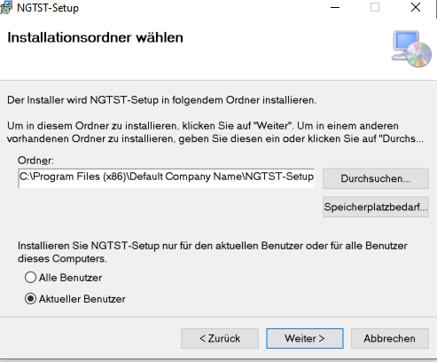
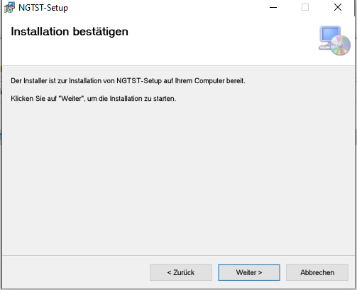
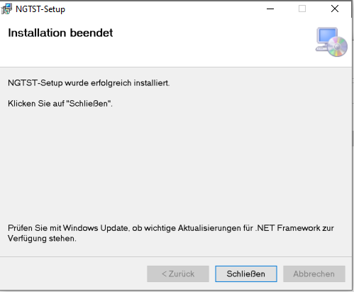
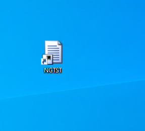
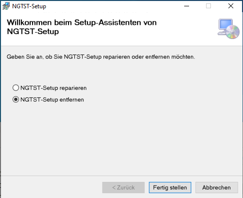

# Guide

## Installation

Aus dem Git-Repository muss unter /setup die NGTST-Setup.msi heruntergeladen werden.

Dieses Setup-File Ausführen.

Im ersten Fenster auf "Weiter"

Hier die Entsprechenden einstellungen auswählen und auf "Weiter". Die Standart-Einstellungen sollten in den Meisten fällen passen.

Die Installation mit "Weiter" starten und den Anschliessenden Dialog bestätigen.

Die Installation ist Beendet, auf dem Desktop befindet sich ein Shortcut.

### Deinstallation

Für die Deinstalltion wird ebenfalls das Setup benötigt. Im ersten Schritt das Setup starten.

Im Setup-Assistent auswählen das die Applikation entfernt werden soll. Anschliessend dem Setup folgen.

### Verwendung der Applikation

Die Applikation kann Jederzeit über den Desktop-Shortcut gestartet werden. Für das Feature "Stationen in der Nähe Anzeigen" muss die Standortfreigabe Aktiviert sein.

### Rechtliches

Diese Applikation wurde zu Ausbildungszwecken im ÜK-318 erstellt.

