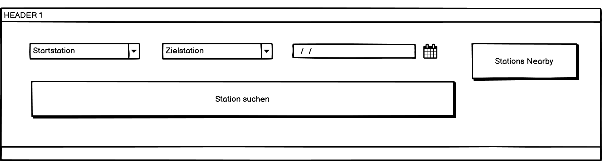
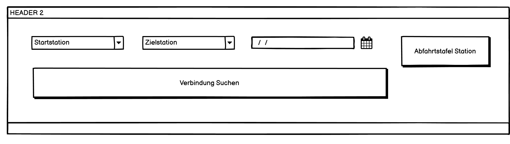
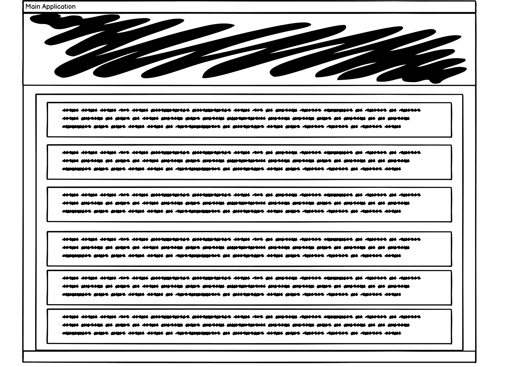

# Mockup

## Header

Die eingaben vom User werden Primär im Header entgegengenommen.

Im ersten Schritt kann der [User](user-story.md#user-roles) eine Station eingeben und nach dieser Station suchen anschliessen werden die Stationen im [Main-GUI](mockup.md#main-gui) angezeigt. Der Benutzer kann auch Stationen in der Nähe anzeigen \(Stations Nearby Button\). Das Selbe gilt für die Zielstation.

Wenn in Startstation eine gültige Station ausgewählt wurde ändert sich der "Stations Nearby"- Button zu "Abfahrtstafel Station". Wenn die Ziel und die Startstation eingetragen sind ändert sich "Station suchen" zu  "Verbindung suchen"

## Main GUI

Der Hauptteil besteht aus einem Main-Gui, im Schwarz angestrichenen bereich befindet sich der [Header](mockup.md#header).

In den Textfeldern werden die Stationen oder Verbindungen aufgelistet. Für Spätere Prioritäten kann dort auch [Karten ](user-story.md#karte)oder [ähnliches ](user-story.md#prioritaetenliste)angezeigt werden.

